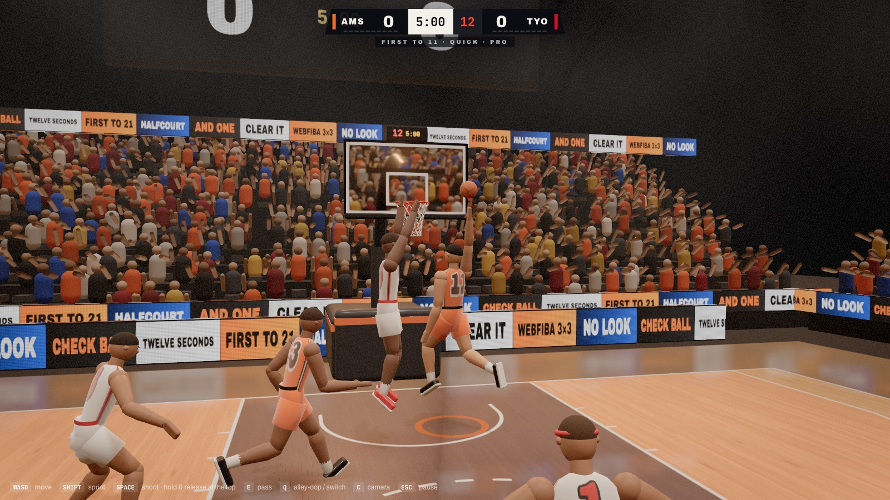
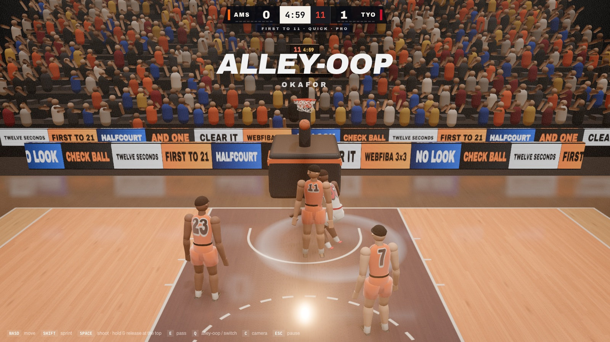
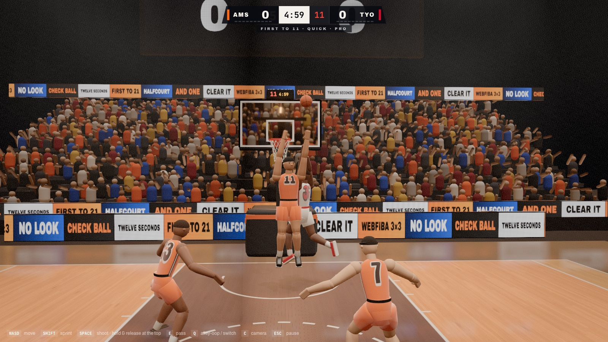
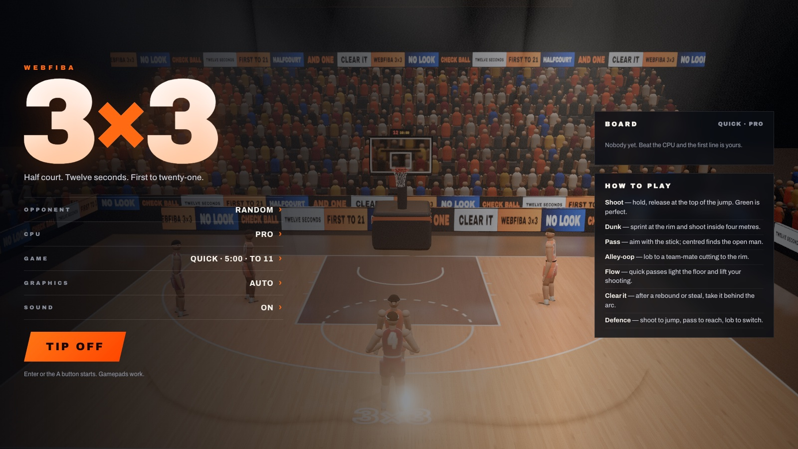

# WebFIBA 3×3

3x3 basketball in the browser, under arena lights. Three a side on a half
court, FIBA rules, against the CPU. Physically based rendering in WebGL2:
a hardwood floor drawn entirely in its shader with real reflections, a glass
board, a net that is cloth, a crowd of a few thousand that stands up for a dunk.

No build step and no `npm install`. The only library is three.js (r186), and it
is in `vendor/`, so the game runs offline and nothing has to be fetched.

**[Play it here](https://markclausing.github.io/webfiba/)**



## Getting started

```bash
npm start            # http://localhost:8080
npm test             # the simulation and the score board, headless
```

## Controls

|                 | Keyboard        | Gamepad   |
| --------------- | --------------- | --------- |
| Move            | `W A S D` / arrows | left stick |
| Sprint          | `Shift`         | RT / R1   |
| Shoot · block   | `Space` / `J`   | X         |
| Pass · steal    | `E` / `K`       | A         |
| Alley-oop · switch | `Q` / `L`    | Y / B     |
| Camera          | `C`             | Select    |
| Pause           | `Esc`           | Start     |

**Every key and pad button can be changed** under CONTROLS in the menu (or in
the timeout menu mid-game): click a box and press what you want. A key that is
already in use moves to the new action rather than meaning two things. There
are three keyboard presets - WASD + Space, Arrows + ZXC, IJKL + ASD - and the
bindings are remembered in the browser. Esc always pauses, whatever else is
bound. On a phone you get a stick and three buttons.

**Shooting** is timing: hold, and let go at the top of the jump. The meter by
the shooter's head has a green band; a green release with nobody in your face
goes in. **Sprint at the rim and shoot** inside about four metres and he dunks -
and a defender who gets up in time can take it off him at the top.

**Passing** goes where the stick points; with the stick centred it finds the
open man, weighted towards anybody cutting to the ring. A white ring on the
floor shows who it will go to - gold when an alley-oop is on.



**Your team-mates play**. They space the floor, cut when their man turns his
head, set screens and roll to the ring, and go and get the lob. Pass and keep
moving: quick ball movement builds **flow** - the chevrons under the score -
which lights the arc in your colour and lifts everybody's shooting.



## The rules

FIBA 3x3, as far as they reach into a game like this:

- Ten minutes or first to 21 (the quick game: five minutes or first to 11).
- One point inside the arc, two behind it.
- A **12 second shot clock**, reset when the ball hits the ring. It is on the
  backboard, where the tour hangs it.
- After a basket the other side takes the ball from under the ring - no inbound
  pass. After a defensive rebound or a steal the ball has to go **behind the
  arc** before it may be scored. The HUD says CLEAR IT until it has.
- Dead balls restart with a check at the top.
- Team fouls 7–9: two free throws. 10 and over: two free throws and the ball.
- Tied at the buzzer: overtime, first side to score two more wins.

## How it is built

```
src/game/      the simulation: 60 ticks a second, seeded, no DOM, runs in Node
  sim.js       rules, shots, passes, dunks, fouls
  ai.js        offence (spacing, cuts, screens, alley-oops) and man-to-man defence
  ball.js      the ball in flight: ring as a torus, glass, net, floor
src/render/    three.js: arena, floor shader, hoop and net cloth, players,
               camera, effects, post (GTAO, bloom, grade, SMAA)
src/audio.js   every sound synthesised, through a generated arena reverb
```

Shots are aimed, not decided: the shooter picks a point in or on the ring and
lets go, and the ball physics decides what happens. That is why misses look
like misses and why some rattle round and drop.

Players are procedural: a rig, tapered bodies round it, poses computed from
what the simulation says they are doing, joints easing on springs, and
two-bone IK to put hands on the ball and on the ring.

Graphics quality picks itself and steps down if the frame rate drops; it can be
set in the menu, or forced with `?quality=low|medium|high|ultra`.



## The score board

Shared with the rest of the family's plumbing: ten wins per list, kept in
localStorage, merged with a shared board when there is one. `npm start` serves
the board in development; in production it is the Cloudflare Worker in
`worker/` - see `worker/README.md`. Until `DEFAULT_BOARD` in `src/config.js` is
filled in, each browser keeps its own.

## Tools

```bash
node tools/simtest.js --report     # CPU against CPU, with the numbers
node tools/controlstest.js         # key bindings: conflicts, presets, saving
node tools/shot.js out.png --play  # a screenshot from headless Chrome (needs npm start)
node tools/make-icons.js
```
